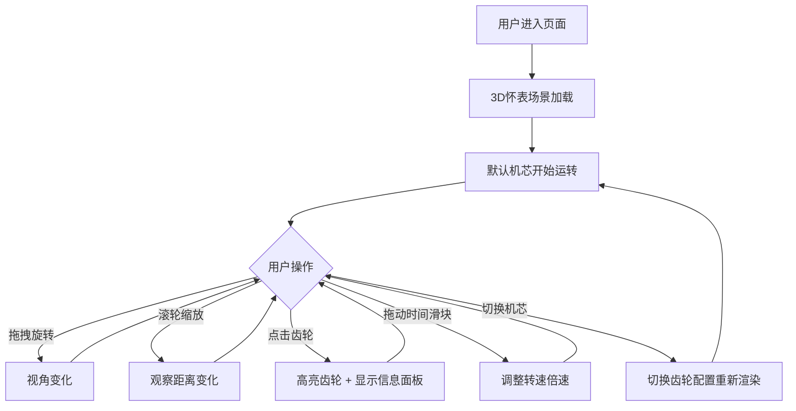

## 1. 产品概述

3D 机械钟表拆解是一款交互式机械机芯可视化应用，通过透明外壳的 3D 怀表，让用户直观了解机械钟表内部齿轮、游丝、擒纵机构的运转原理。

- 目标用户：钟表爱好者、机械工程学习者、对机械原理感兴趣的普通用户
- 核心价值：将复杂的机械钟表机芯以 3D 交互式方式呈现，帮助用户理解齿轮传动、擒纵调速、游丝振荡的工作原理

## 2. 核心功能

### 2.1 功能模块

1. **3D 机械钟表展示页**：主场景、齿轮传动、游丝擒纵、控制面板、信息面板、机芯切换

### 2.2 页面详情

| 页面名称 | 模块名称 | 功能描述 |
|-----------|-------------|---------------------|
| 3D 机械钟表展示页 | 主场景渲染 | 悬浮的 3D 怀表，透明外壳展示内部多层齿轮结构 |
| 3D 机械钟表展示页 | 齿轮传动系统 | 中心轮、过轮、秒轮、擒纵轮等齿轮按真实传动比咬合转动 |
| 3D 机械钟表展示页 | 游丝擒纵机构 | 游丝摆轮振荡、擒纵叉与擒纵轮配合实现等时性调速 |
| 3D 机械钟表展示页 | 视角交互 | 鼠标拖拽旋转视角、滚轮缩放观察齿轮咬合细节 |
| 3D 机械钟表展示页 | 齿轮选中交互 | 点击任意齿轮高亮并显示名称、转速、传动比等信息 |
| 3D 机械钟表展示页 | 时间流速控制 | 滑块调节时间倍速（0.1x ~ 50x），支持快放与慢放 |
| 3D 机械钟表展示页 | 机芯切换 | 提供 3 种经典机芯结构可切换（瑞士杠杆式、同轴擒纵、陀飞轮） |

## 3. 核心流程

用户进入页面后，默认展示瑞士杠杆式机芯的 3D 怀表，外壳透明可直接看到内部齿轮运转。用户可以：

1. 拖拽鼠标旋转视角，滚轮缩放观察细节
2. 点击任意齿轮查看其名称和转速信息
3. 通过时间滑块调整观察速度
4. 切换不同机芯结构对比差异

## 4. 用户界面设计

### 4.1 设计风格

- **主色调**：深邃午夜蓝 (#0a0e1a) 作为背景，搭配金色 (#d4af37) 与古铜色 (#8b6914) 作为机械零件色，突出高级钟表质感
- **强调色**：高亮选中使用琥珀金 (#ffb347) 发光效果
- **字体**：使用 Cinzel（优雅衬线字体）作为标题字体，搭配 Cormorant Garamond 正文，营造古典制表美学
- **按钮风格**：圆角胶囊形按钮，金属质感渐变边框，悬停时微弱发光
- **布局风格**：沉浸式全屏 3D 场景 + 四周悬浮玻璃拟态控制面板
- **图标风格**：Lucide 线性图标，统一 1px 线条宽度

### 4.2 页面设计概述

| 页面名称 | 模块名称 | UI 元素 |
|-----------|-------------|-------------|
| 3D 机械钟表展示页 | 主场景 | 居中悬浮怀表，深色渐变背景 + 微弱光晕 |
| 3D 机械钟表展示页 | 顶部标题 | 应用名称 + 副标题，居中顶部，金色文字 |
| 3D 机械钟表展示页 | 左侧机芯切换面板 | 玻璃拟态卡片，3 个机芯选项按钮，垂直排列 |
| 3D 机械钟表展示页 | 底部时间控制栏 | 玻璃拟态横条，倍速标签 + 滑块 + 播放/暂停按钮 |
| 3D 机械钟表展示页 | 右侧齿轮信息面板 | 玻璃拟态卡片，选中后显示齿轮名称、转速、齿数、传动比 |
| 3D 机械钟表展示页 | 操作提示 | 左下角小字提示拖拽/缩放/点击操作 |

### 4.3 响应式设计

- 桌面端优先设计，主场景占据视口 100%
- 移动端：控制面板自动调整为底部堆叠布局，缩小字体与按钮尺寸
- 触屏设备：支持单指拖拽旋转、双指捏合缩放

### 4.4 3D 场景指引

- **环境**：深色宇宙级背景，加轻微径向光晕聚焦中心怀表，使用柔和环境光 + 三盏方向光源（主光、补光、轮廓光）营造金属质感
- **光照设置**：Key Light (暖白，右上，强度 1.2)，Fill Light (冷白，左下，强度 0.5)，Rim Light (金色，背后，强度 0.8)
- **相机**：PerspectiveCamera，初始距离 8，俯仰角 25°，支持 OrbitControls 交互
- **构图**：怀表居中，上下左右各留 30% 留白，控制面板浮于四周不遮挡主体
- **交互动画**：齿轮高亮时 scale 轻微放大 + emissive 发光，选中信息面板淡入滑出
- **后处理**：Bloom 泛光效果增强金色金属质感，轻微 SSAO 提升空间层次感
- **性能**：所有几何体采用低多边形齿轮模型，单面材质，目标帧率 60fps
