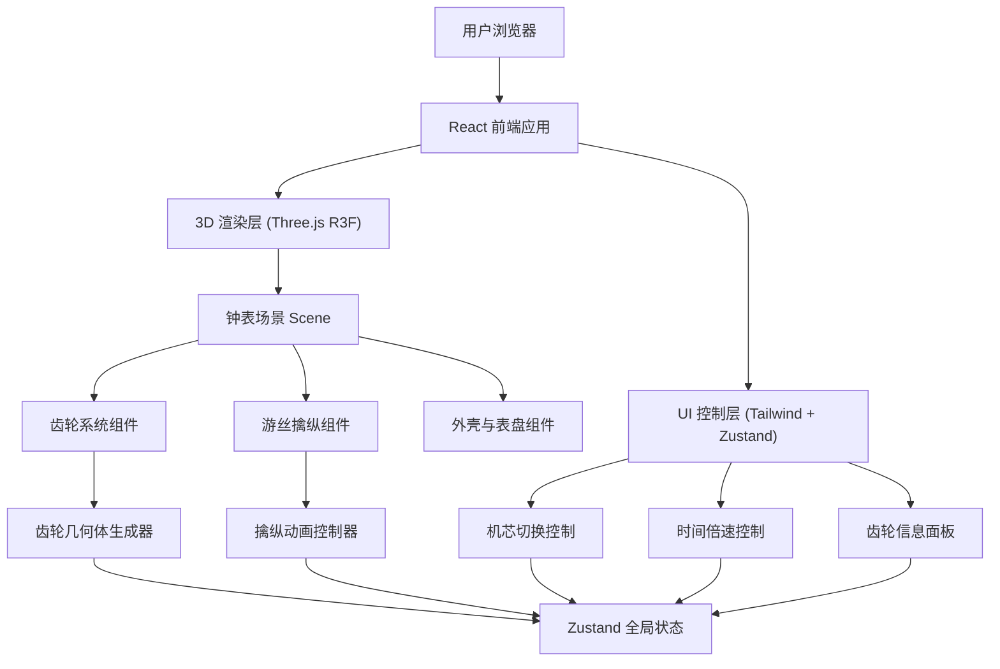

## 1. 架构设计



## 2. 技术选型

- **前端框架**：React@18 + TypeScript@5
- **构建工具**：Vite@5
- **样式方案**：TailwindCSS@3
- **3D 渲染**：three@0.160, @react-three/fiber@8, @react-three/drei@9, @react-three/postprocessing@2
- **状态管理**：zustand@4
- **图标库**：lucide-react@0.312
- **初始化模板**：vite-init (react-ts)

## 3. 路由定义

| 路由 | 用途 |
|-------|---------|
| / | 主页面 - 3D 机械钟表拆解交互场景 |

## 4. 核心数据结构

### 4.1 Zustand Store 定义

```typescript
// 机芯类型
type MovementType = 'swiss-lever' | 'co-axial' | 'tourbillon';

// 齿轮配置
interface GearConfig {
  id: string;
  name: string;        // 中文名称，如"中心轮"
  nameEn: string;      // 英文名称，如"Center Wheel"
  teeth: number;       // 齿数
  position: [number, number, number]; // 3D 位置
  radius: number;      // 齿轮半径
  thickness: number;   // 齿轮厚度
  rotationAxis: 'x' | 'y' | 'z'; // 旋转轴
  baseSpeed: number;   // 基准角速度 (rad/s)，对应 1x 时间流速
  color: string;       // 颜色
  connectsTo?: string[]; // 传动连接的其他齿轮 id
}

// 机芯配置
interface MovementConfig {
  id: MovementType;
  name: string;
  description: string;
  gears: GearConfig[];
  hasTourbillon?: boolean;
}

// Store 状态
interface WatchStore {
  movementType: MovementType;
  setMovementType: (t: MovementType) => void;
  timeScale: number;   // 时间倍速 0.1 ~ 50
  setTimeScale: (s: number) => void;
  isPlaying: boolean;
  togglePlay: () => void;
  selectedGearId: string | null;
  setSelectedGearId: (id: string | null) => void;
  getGearConfig: (id: string) => GearConfig | undefined;
  getCurrentMovement: () => MovementConfig;
}
```

### 4.2 机芯数据（内嵌常量，无需后端）

内置 3 套机芯配置，每套包含 6-8 个齿轮，传动比按真实钟表近似比例设计。

## 5. 模块划分

```
src/
├── components/
│   ├── watch3d/
│   │   ├── WatchScene.tsx        # 3D 场景容器，灯光相机
│   │   ├── PocketWatch.tsx       # 怀表整体装配（外壳+内部）
│   │   ├── Gear.tsx              # 单个齿轮组件
│   │   ├── GearTrain.tsx         # 齿轮系（所有齿轮组合）
│   │   ├── Escapement.tsx        # 擒纵机构（擒纵轮+擒纵叉+摆轮游丝）
│   │   ├── WatchCase.tsx         # 透明外壳与表盘
│   │   └── Tourbillon.tsx        # 陀飞轮组件（可选）
│   ├── ui/
│   │   ├── MovementSelector.tsx  # 机芯切换面板
│   │   ├── TimeControl.tsx       # 时间倍速控制栏
│   │   ├── GearInfoPanel.tsx     # 齿轮信息展示面板
│   │   ├── Header.tsx            # 顶部标题
│   │   └── HintTips.tsx          # 操作提示
│   └── App.tsx                   # 主应用入口
├── store/
│   └── useWatchStore.ts          # Zustand 全局状态
├── data/
│   └── movements.ts              # 三套机芯配置常量数据
├── utils/
│   └── gearGeometry.ts           # 齿轮几何体生成工具
├── types/
│   └── index.ts                  # 全局 TypeScript 类型
├── main.tsx
└── index.css
```

## 6. 核心实现要点

### 6.1 齿轮几何体生成

使用 Three.js `ExtrudeGeometry` + 自定义 Shape 绘制齿轮轮廓：
1. 计算齿顶圆、齿根圆、基圆半径
2. 使用渐开线方程生成齿牙轮廓点
3. 使用 2D Shape 连接所有点后挤出厚度
4. 支持参数化：齿数、模数、压力角、厚度

### 6.2 齿轮动画同步

每个齿轮通过 `useFrame` 钩子根据 `baseSpeed * timeScale` 计算旋转角度，保证所有齿轮按传动比同步转动。传动关系通过 `connectsTo` 定义，视觉咬合通过位置和半径计算确保准确。

### 6.3 交互拾取

使用 `@react-three/drei` 的 `<Interactive>` 组件或原生 Three.js Raycaster 实现：
1. 鼠标悬停时齿轮 emissive 颜色微亮
2. 点击时记录 `selectedGearId` 并触发高亮动画（scale + emissive强度变化）
3. `GearInfoPanel` 根据选中的 id 读取配置显示信息

### 6.4 视角控制

使用 `@react-three/drei` 的 `<OrbitControls>`：
- enableDamping: true（阻尼平滑）
- minDistance: 3（最近观察距离，能看清齿牙）
- maxDistance: 20（最远观察距离）
- minPolarAngle: 0.1，maxPolarAngle: Math.PI * 0.85（限制俯仰角，不能翻到背面下方）

### 6.5 擒纵机构动画

擒纵叉和摆轮采用独立动画逻辑，不与齿轮系硬绑定：
- 摆轮按摆频（如 4Hz）做正弦摆动
- 擒纵叉根据摆轮相位做左右杠杆运动
- 擒纵轮一齿一齿步进（与摆频同步，每半周期走一齿）
- 游丝用螺旋线 Geometry + 顶点动画模拟收缩扩张
